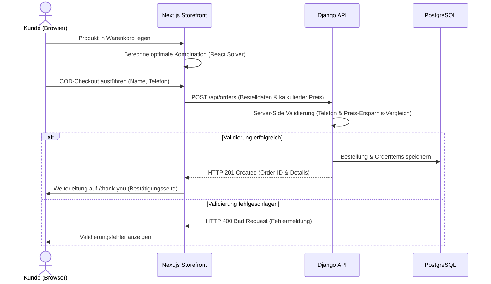

# 🌸 HAWN – Luxus E-Commerce Storefront & Backend (COD)

Eine hochgradig optimierte, zweisprachige (Fokus auf Arabisch RTL) E-Commerce-Plattform für erstklassige Beauty-, Wellness- und Self-Care-Produkte im saudi-arabischen Raum. Dieses Projekt kombiniert ein ultraschnelles Next.js Frontend mit einem robusten Django-REST-Backend und ist speziell auf **Cash on Delivery (COD)** und **Conversion-Rate-Optimierung (CRO)** ausgelegt.

---

## 📖 Inhaltsverzeichnis

- [✨ Über HAWN](#-über-hawn)
- [🛠️ Architektur & Tech-Stack](#️-architektur--tech-stack)
- [🚀 Kernfunktionen & Highlights](#-kernfunktionen--highlights)
- [📊 Datenfluss & Systemarchitektur](#-datenfluss--systemarchitektur)
- [📂 Projektstruktur](#-projektstruktur)
- [💻 Lokale Entwicklung](#-lokale-entwicklung)
  - [Frontend (Next.js)](#frontend-nextjs)
  - [Backend (Django)](#backend-django)
- [🐳 Deployment & DevOps](#-deployment--devops)
- [🛡️ Datenbank & Admin-Bereich](#️-datenbank--admin-bereich)

---

## ✨ Über HAWN

HAWN ist eine E-Commerce-Plattform im Premium-Segment, die sich auf ausgewählte, klinisch geprüfte Beauty- und Wellness-Rituale spezialisiert hat. Im Gegensatz zu überfüllten Marktplätzen setzt HAWN auf Minimalismus: Wenige, aber extrem wirksame Produkte (wie das *Rafah Heated Lash Curler* oder das *Sakeena Eye Massager*), präsentiert in einem luxuriösen, ansprechenden Design, inspiriert von modernen E-Commerce-Vorreitern wie `namabeauty.shop`.

---

## 🛠️ Architektur & Tech-Stack

Die Plattform ist in eine entkoppelte Headless-Architektur unterteilt:

### 💻 Frontend (Storefront)
*   **Framework**: **Next.js 16 (App Router)** mit React 19.
*   **Rendering-Strategie**: **Incremental Static Regeneration (ISR)** mit einem 30-Sekunden-Revalidierungsintervall für maximale Ladezeiten und dynamische Datenaktualisierung.
*   **Styling**: **Tailwind CSS v4** kombiniert mit **Vanilla CSS variables** für ein konsistentes Design-System (Schriftarten, Farben wie Rose, Plum, Blush und Cream).
*   **Icons**: **Lucide React** für moderne Vektorgrafiken.
*   **Performance**: Nahtlose Optimierung mit dem Next.js `<Image />`-Komponenten zur Vermeidung von Layout-Shifts (CLS).

### ⚙️ Backend (API & Admin)
*   **Framework**: **Django 5** mit **Django REST Framework (DRF)**.
*   **Datenbank**: **PostgreSQL** für relationale Datenhaltung und Transaktionssicherheit.
*   **Containerisierung**: **Docker** & **Docker Compose** für konsistente Laufzeitumgebungen.
*   **Speicher**: **FileSystemStorage** für hochgeladene Produktmedien.

---

## 🚀 Kernfunktionen & Highlights

### 🛒 1. Intelligenter Bundle-Rabatt-Algorithmus (Optimal Cart Solver)
Um den durchschnittlichen Bestellwert (AOV) zu maximieren, bietet HAWN Paket-Rabatte an (z. B. 3er-Komplettset "الروتين الكامل" für 499 SAR statt 597 SAR). 
*   **Client-Side Solver**: Ein rekursiver Kombinations-Algorithmus in React berechnet zur Laufzeit im Warenkorb die mathematisch günstigste Kombination der Produkte und zeigt dem Kunden sofort seine Ersparnis an.
*   **Server-Side Verifikation**: Das Django-Backend nutzt denselben Algorithmus bei der Bestellübermittlung, validiert die Preise und verteilt die Rabatte proportional auf die einzelnen Rechnungsposten im Datenbanksystem.

### 📱 2. Nahtloser COD-Checkout (Cash on Delivery)
Speziell für den nahöstlichen Markt optimierter Checkout:
*   Bestellungen können mit nur zwei Feldern aufgegeben werden: **Name** und **Telefonnummer**.
*   Integrierte Client- und Server-Validierung für saudi-arabische Mobilfunknummern (Präfix- und Längenprüfungen für Anbieter wie STC, Mobily und Zain).
*   Verhinderung von Dubletten-Bestellungen innerhalb kurzer Zeitfenster auf API-Ebene.

### 🎨 3. Premium UI/UX & Responsive Layouts
*   **Ästhetisches Design**: Sanfte Verläufe (Radial Gradients) in Beige- und Cremetönen, passend zur Bildästhetik des Hero-Banners.
*   **Hover- & Mikroanimationen**: Sanfte Übergänge, Glow-Effekte und responsive Cards, die auf mobile Berührungen reagieren.
*   **Swipable Cross-Sells**: Produktempfehlungen im Warenkorb und auf Artikelseiten verhalten sich auf Mobilgeräten wie ein horizontales Karussell (`scroll-snap-type`) statt starr zu stapeln.

### 🎛️ 4. Dynamische Produkt-Deaktivierung (Dynamic Hiding)
Wenn ein Produkt im Django-Admin auf `is_active = False` gesetzt wird:
*   Wird es automatisch aus allen Navigationsmenüs (Header, Footer, Mobile Menu) gefiltert.
*   Wird es aus den Produkt-Grids der Startseite und des Shops ausgeblendet.
*   Gibt die Detailseite unter `/products/[slug]` sofort einen sauberen `404 Not Found` zurück.
*   *Dank ISR aktualisiert sich die gesamte Seite innerhalb von 30 Sekunden ohne erneutes Deployment.*

### 📂 5. Medien- & Galerie-Upload im Admin-Panel
*   Direkter Upload von Produktbildern, mobilen Bannern und Feature-Grafiken direkt aus dem lokalen Dateisystem über das Django-Admin.
*   `TabularInline`-Konfiguration für Galerien und Schritt-für-Schritt-Anleitungen ("How-To-Use"), die dynamisch an das Next.js Frontend ausgeliefert werden.

---

## 📊 Datenfluss & Systemarchitektur



---

## 📂 Projektstruktur

```text
i-want-to-start-a-new/
├── backend/                  # Django REST API & Admin-Schnittstelle
│   ├── hawn_backend/         # Projekt-Konfiguration (Settings, URLs)
│   ├── orders/               # Kernanwendung (Modelle, Serializer, Views, Admin)
│   ├── media/                # Upload-Verzeichnis für Produktbilder
│   ├── Dockerfile            # Container-Rezept für die Django-API
│   └── manage.py
├── src/                      # Next.js Frontend (Storefront)
│   ├── app/                  # App Router Pages & API-Proxies
│   │   ├── page.tsx          # Personalisierte Premium-Startseite
│   │   ├── cart/             # Warenkorb-Seite
│   │   ├── products/[slug]/  # Dynamische Produktdetailseiten
│   │   └── globals.css       # Zentrales CSS-Designsystem & Tailwind v4
│   ├── components/           # Wiederverwendbare UI-Komponenten (Header, Footer, etc.)
│   ├── lib/                  # Hilfsfunktionen & API-Clients
│   └── Dockerfile            # Container-Rezept für das Next.js Frontend
├── scripts/                  # DevOps & Automatisierungs-Skripte
│   └── deploy-server.sh      # Deployment-Skript für Hetzner VPS (Docker Swarm)
├── docker-compose.yml        # Lokale Container-Orchestrierung
└── package.json
```

---

## 💻 Lokale Entwicklung

### Voraussetzungen
*   **Node.js** (v20 oder neuer)
*   **Python** (v3.11 oder neuer)
*   **PostgreSQL** (oder Verwendung von SQLite als temporäres Entwicklungs-Backend)

---

### Frontend (Next.js)

1.  **Abhängigkeiten installieren**:
    ```bash
    npm install
    ```

2.  **Umgebungsvariablen konfigurieren** (Datei `.env.local` erstellen):
    ```env
    ORDER_BACKEND_URL=http://localhost:8000
    ORDER_BACKEND_TOKEN=dein_lokaler_api_token
    ```

3.  **Entwicklungsserver starten**:
    ```bash
    npm run dev
    ```
    Das Frontend ist nun unter `http://localhost:3000` erreichbar.

4.  **Produktions-Build testen**:
    ```bash
    npm run build
    npm run start
    ```

---

### Backend (Django)

1.  **Virtuelle Python-Umgebung erstellen**:
    ```bash
    cd backend
    python3 -m venv .venv
    source .venv/bin/activate
    ```

2.  **Abhängigkeiten installieren**:
    ```bash
    pip install -r requirements.txt
    ```

3.  **Datenbankmigrationen ausführen**:
    ```bash
    python manage.py makemigrations
    python manage.py migrate
    ```

4.  **Testdaten einspielen (Seeding)**:
    ```bash
    python manage.py seed_products
    ```

5.  **Superuser für das Admin-Panel erstellen**:
    ```bash
    python manage.py createsuperuser
    ```

6.  **Lokalen Django-Server starten**:
    ```bash
    python manage.py runserver
    ```
    Die API ist unter `http://localhost:8000` erreichbar. Das Admin-Panel findest du unter `http://localhost:8000/admin/`.

---

## 🐳 Deployment & DevOps

Das Projekt verwendet ein automatisiertes Deployment über **Docker Swarm** auf einem Hetzner VPS.

### Deployment-Ablauf (`scripts/deploy-server.sh`)

Das Deployment-Skript automatisiert den gesamten Prozess ohne Ausfallzeit (Zero-Downtime):

1.  **Backend rsync**: Überträgt den `/backend`-Ordner (ausgenommen Caches und DB) auf den VPS.
2.  **Backend Build**: Baut das Docker-Image `hawn-backend` direkt auf dem Server.
3.  **Backend Update**: Aktualisiert den Docker Swarm Service `hawn_backend` und erzwingt den Image-Wechsel.
4.  **Frontend rsync**: Kopiert die Quellcodedateien des Storefronts auf den Server.
5.  **Frontend Build**: Baut das Docker-Image `hawn-storefront` (inklusive Next.js-Build).
6.  **Frontend Update**: Aktualisiert den Swarm Service `hawn_storefront` mit dem neuen Image.

Ausführen des Deployments:
```bash
./scripts/deploy-server.sh
```

---

## 🛡️ Datenbank & Admin-Bereich

### Django Product Model (`backend/orders/models.py`)

Die Produkteigenschaften und Galerien sind voll dynamisch definiert:

| Feldname | Datentyp | Beschreibung |
| :--- | :--- | :--- |
| `name` | `CharField` | Produktname (z. B. "رفعة برو") |
| `slug` | `SlugField` | URL-konformer Name (z. B. "rafah-heated-lash-curler") |
| `price` | `DecimalField` | Normaler Verkaufspreis in SAR |
| `compare_at_price` | `DecimalField` | Durchgestrichener Streichpreis zur Kontrastierung |
| `is_active` | `BooleanField` | Statussteuerung (Aktiv/Deaktiviert) |
| `image_url` | `ImageField` | Haupt-Produktbild (Desktop) |
| `mobile_image_url` | `ImageField` | Haupt-Produktbild (Mobile) |

Verwandte Galeriemodelle ermöglichen es, beliebig viele zusätzliche Feature-Bilder, Inhaltsstoffe oder Anwendungsschritte pro Produkt hochzuladen, die vollautomatisch vom Storefront gerendert werden.

---

*Herausgegeben vom Entwicklerteam für HAWN. Für Support oder Fragen, wenden Sie sich bitte an das entsprechende DevOps-Verzeichnis.*
